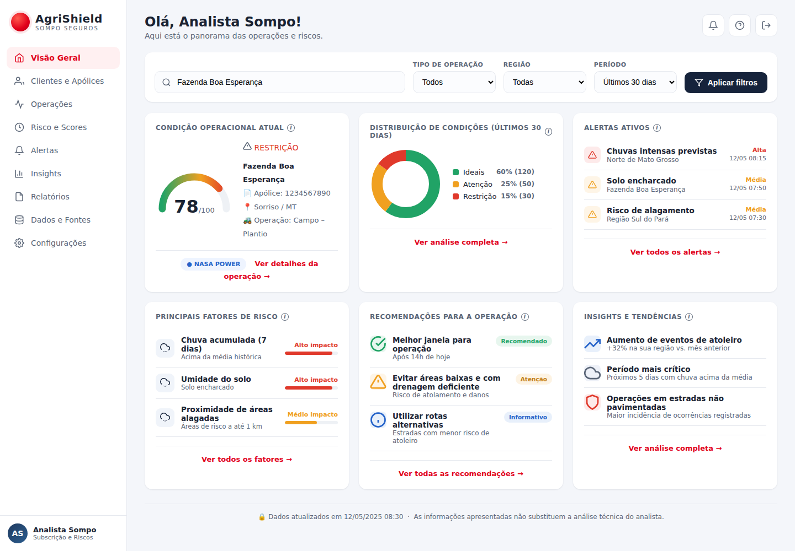
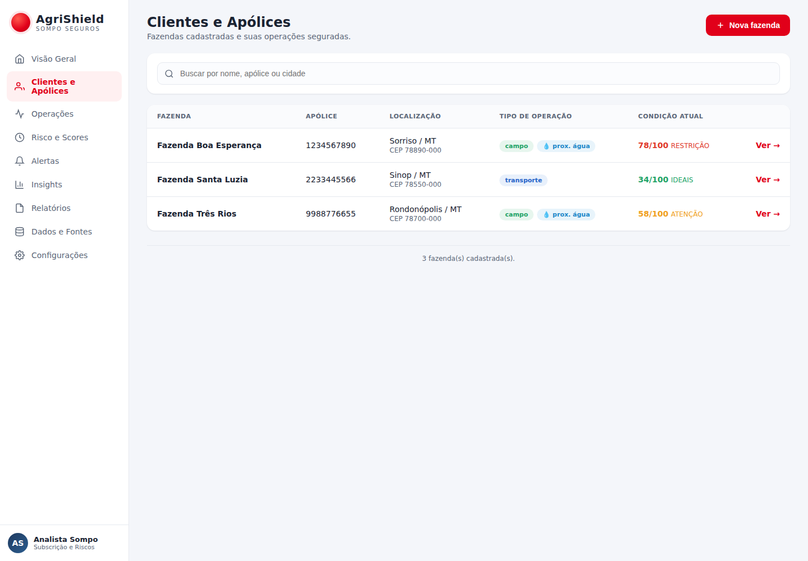
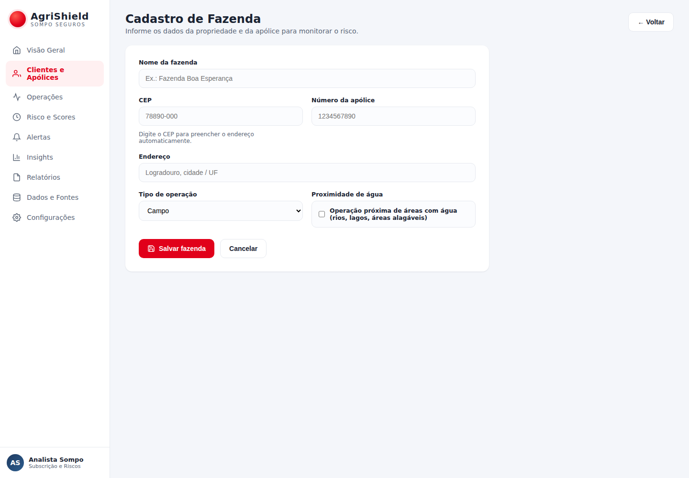

<div align="center">

# 🌾 AgriShield

### Protótipo navegável para análise de risco em operações agrícolas

**Challenge Sompo Seguros — React + FastAPI + NASA POWER + Open-Meteo**


</div>

---

## 📌 Sobre o projeto

O **AgriShield** é um protótipo acadêmico desenvolvido a partir do wireframe **Analista Sompo**. A aplicação permite cadastrar fazendas, consultar dados agroclimáticos, calcular indicadores de risco operacional e exibir alertas de forma visual e explicável.

O projeto combina dados cadastrados pelo usuário com informações de fontes públicas:

- **INMET** para dados meteorológicos observados;
- **Open-Meteo** para previsão/modelagem meteorológica;
- **NASA POWER** para dados históricos e representação regional;
- **SRTM/MERIT Hydro** para atributos estruturais e geoespaciais;
- **MapBiomas** para uso e cobertura da terra e contexto territorial;
- **CSV local** para persistência do protótipo e consulta de coordenadas;
- **ViaCEP** para validação e preenchimento de endereços brasileiros;
- **regras de risco próprias** para gerar indicadores como solo encharcado e risco de alagamento.

> [!IMPORTANT]
> Para instalar o projeto em um computador do zero, consulte também o arquivo [`INSTALACAO_DO_ZERO.md`](INSTALACAO_DO_ZERO.md).

---

## 🖥️ Prévia das telas

### Visão Geral



### Clientes e Apólices



### Cadastro de Fazenda



---

## ✨ Funcionalidades principais

### 🏡 Cadastro de fazendas

O usuário pode cadastrar uma nova propriedade informando:

- nome da fazenda;
- CEP;
- endereço;
- número da apólice;
- tipo de operação: **campo** ou **transporte**;
- proximidade de água.
- várias apólices;
- coordenadas da sede confirmadas no mapa;
- perímetro da propriedade em GeoJSON.

O CEP é consultado no **ViaCEP** para preencher logradouro, bairro, cidade e
UF. Como o ViaCEP não fornece coordenadas, latitude e longitude só são sugeridas
quando existe uma correspondência exata na base geográfica local; elas também
podem ser informadas manualmente.

As fazendas cadastradas podem ser editadas posteriormente pela tela de
**Clientes e Apólices**.

### 👥 Clientes e Apólices

A tela permite:

- visualizar as fazendas cadastradas;
- pesquisar por nome, apólice ou cidade;
- identificar o tipo de operação;
- visualizar proximidade de água;
- acessar diretamente o dashboard da fazenda.
- editar os dados cadastrais da fazenda;
- carregar a condição atual persistida sem precisar abrir cada registro.
- identificar data e origem real/simulada do score;
- acompanhar o processamento climático em segundo plano;
- arquivar e restaurar fazendas sem excluir o histórico;
- exportar relatório PDF por apólice.

O formulário avisa antes de descartar alterações não salvas. A listagem usa
skeletons durante a carga e se transforma em cartões em telas pequenas. Consulte
[`docs/PORTFOLIO_AVANCADO.md`](docs/PORTFOLIO_AVANCADO.md) para detalhes.

### 📊 Dashboard de risco

O dashboard apresenta:

- **Condição Operacional Atual**;
- **score de risco de 0 a 100**;
- **Distribuição de Condições dos últimos 30 dias**;
- **Alertas Ativos**;
- **Principais Fatores de Risco**;
- **Recomendações**;
- **Insights e Tendências**.

---

## 🧠 Como o AgriShield funciona

```text
Cadastro da fazenda
        │
        ▼
   fazendas.csv
        │
        ▼
CEP → latitude/longitude
        │
        ├─────────────────────────────┐
        │                             │
        ▼                             ▼
   NASA POWER                    Open-Meteo
        │                             │
        ▼                             ▼
Dados agroclimáticos            Previsão 5 dias
        │                             │
        ▼                             │
Engenharia de variáveis              │
        │                             │
        ├── Chuva acumulada           │
        ├── Solo encharcado           │
        ├── Condição operacional      │
        ├── Score de risco            │
        └── Fatores de risco          │
        │                             │
        └──────────────┬──────────────┘
                       ▼
              Risco de alagamento
                       │
                       ▼
                Dashboard React
```

---

## 🗂️ Estrutura do projeto

```text
agrishield/
├── backend/
│   ├── app/
│   │   ├── __init__.py
│   │   ├── main.py
│   │   └── servicos_externos.py
│   ├── data/
│   │   ├── base_coordenadas_cep.csv
│   │   ├── fazendas.csv
│   │   └── arquivos gerados pelo ETL
│   ├── etl/
│   │   ├── __init__.py
│   │   ├── etapa1_cadastro_fazendas.py
│   │   ├── etapa2_coleta_nasa_power.py
│   │   └── etapa3_engenharia_variaveis.py
│   ├── iniciar_backend.bat
│   ├── requirements.txt
│   └── run_api.py
│
├── frontend/
│   ├── src/
│   │   ├── App.jsx
│   │   ├── main.jsx
│   │   └── styles.css
│   ├── .npmrc
│   ├── index.html
│   ├── iniciar_frontend.bat
│   ├── package.json
│   └── vite.config.js
│
├── docs/
│   ├── docs_cadastro.png
│   ├── docs_clientes.png
│   └── docs_dashboard.png
│
├── 00_instalar_pre_requisitos.bat
├── 01_instalar_dependencias.bat
├── 02_iniciar_projeto.bat
├── 03_executar_etl_completo.bat
├── 04_verificar_instalacao.bat
├── 05_reinstalar_backend.bat
├── 06_reinstalar_frontend.bat
├── 07_abrir_github.bat
├── 08_testar_nasa_power.bat
├── INSTALACAO_DO_ZERO.md
├── GITHUB.md
├── README.md
└── .gitignore
```

---

## ⚙️ Tecnologias utilizadas

| Camada | Tecnologia | Finalidade |
|---|---|---|
| Frontend | React 18 | Construção da interface |
| Build frontend | Vite 5 | Servidor de desenvolvimento e build |
| Backend | FastAPI | API REST da aplicação |
| Servidor ASGI | Uvicorn | Execução local da API |
| Dados | Pandas / NumPy | Tratamento e engenharia de variáveis |
| HTTP | Requests | Consumo das APIs externas |
| Dados climáticos | NASA POWER | Histórico agroclimático |
| Previsão | Open-Meteo | Previsão meteorológica |
| Persistência | CSV | Armazenamento do protótipo |

---

## 🔄 Pipeline de dados

### 1️⃣ Etapa 1 — Cadastro das fazendas

Arquivo:

```text
backend/etl/etapa1_cadastro_fazendas.py
```

Responsabilidades:

- criar o arquivo `backend/data/fazendas.csv` caso ainda não exista;
- criar a base estática de coordenadas por CEP;
- listar fazendas cadastradas;
- adicionar novas fazendas;
- armazenar latitude e longitude.

---

### 2️⃣ Etapa 2 — Coleta NASA POWER

Arquivo:

```text
backend/etl/etapa2_coleta_nasa_power.py
```

Parâmetros utilizados:

- temperatura média;
- temperatura máxima;
- temperatura mínima;
- precipitação;
- umidade relativa;
- radiação solar;
- velocidade do vento.

Exemplo de saída:

```text
backend/data/nasa_power_bruto_1.csv
```

> [!NOTE]
> Caso a NASA POWER esteja temporariamente indisponível, o sistema utiliza uma série simulada realista para não interromper a demonstração.

---

### 3️⃣ Etapa 3 — Engenharia de variáveis

Arquivo:

```text
backend/etl/etapa3_engenharia_variaveis.py
```

Indicadores gerados:

- dias sem chuva consecutivos;
- faixa de dias sem chuva;
- nível de risco agroclimático;
- chuva acumulada em 3 dias;
- chuva acumulada em 7 dias;
- umidade média de 3 dias;
- solo encharcado;
- condição operacional;
- score de risco;
- fatores explicáveis de risco;
- risco de alagamento.

Exemplos de saída:

```text
backend/data/nasa_power_enriquecido_1.csv
backend/data/dashboard_indicadores_1.csv
```

---

### 4️⃣ Etapa 4 — Contexto geoespacial SRTM/MERIT

Arquivo principal:

```text
backend/etl/etapa4_dados_geoespaciais.py
```

Essa etapa produz declividade, posição topográfica relativa, distância à
drenagem e área de drenagem montante. A Exposição de Maquinário v1 exige esse
contexto além da série meteorológica. Os valores vigentes ficam em
`backend/data/fazendas_geoespaciais.csv`; o cache JSON local é apenas uma
otimização e, quando ausente em um clone/ZIP, o contrato é reconstruído de
forma validada a partir do CSV.

Para recalcular os dados ou analisar uma fazenda nova é necessário configurar
o Google Earth Engine conforme a seção abaixo.

---

## 🌧️ Regras de risco do protótipo

### Solo encharcado

O indicador combina **chuva acumulada recente** e **umidade elevada**. Quando os limites definidos na engenharia de variáveis são atingidos, a operação pode receber uma classificação de maior risco.

### Risco de alagamento

A regra combina informações de diferentes fontes:

1. chuva acumulada obtida pela NASA POWER;
2. condição de solo encharcado;
3. proximidade de água informada no cadastro;
4. precipitação prevista pela Open-Meteo.

Essa abordagem permite demonstrar uma decisão **explicável**, já que os fatores utilizados no cálculo podem ser apresentados ao analista.

---

## 🚀 Instalação rápida no Windows

### Pré-requisitos

Antes de iniciar, tenha instalado:

- **Python 3.12 ou 3.13**;
- **Node.js LTS**;
- **npm**;
- conexão com a internet para instalar dependências e acessar APIs públicas.

### Instalação automática

Na raiz do projeto, execute os arquivos abaixo **na ordem**:

```text
1. 00_instalar_pre_requisitos.bat
2. 01_instalar_dependencias.bat
3. 04_verificar_instalacao.bat
4. 02_iniciar_projeto.bat
```

Se o primeiro BAT instalar Python ou Node.js, feche o terminal e abra novamente antes de executar o próximo arquivo.

### Acessos locais

Depois de iniciar o projeto:

| Serviço | Endereço |
|---|---|
| 🌐 Frontend React | `http://127.0.0.1:5173` |
| ⚡ API FastAPI | `http://127.0.0.1:8000` |
| 📚 Swagger | `http://127.0.0.1:8000/docs` |

Para instruções completas, consulte [`INSTALACAO_DO_ZERO.md`](INSTALACAO_DO_ZERO.md).

---

## 📦 Dependências do backend

Arquivo: `backend/requirements.txt`

```txt
fastapi==0.115.0
uvicorn==0.30.6
pydantic==2.9.2
requests==2.32.3
pandas==2.2.3
numpy==2.1.3
earthengine-api==1.7.38
httpx==0.28.1
python-dotenv==1.2.2
```

O projeto foi preparado para **Python 3.12 e Python 3.13**.

As versões de Pandas e NumPy foram ajustadas para evitar a necessidade de compilação local no Python 3.13.

---

## Google Earth Engine

As fazendas de demonstração que já possuem contexto persistido podem abrir a
tela de Exposição sem uma nova consulta ao Earth Engine. Configure o serviço
para cadastrar/recalcular outras fazendas e para usar o MapBiomas.

Instale as dependências pelo BAT ou, manualmente, com o Python da própria venv:

```powershell
backend\.venv\Scripts\python.exe -m pip install -r backend\requirements.txt
```

Autentique sua conta uma única vez:

```powershell
backend\.venv\Scripts\python.exe -c "import ee; ee.Authenticate()"
```

Crie a configuração local e substitua o valor pelo ID de um projeto Google
Cloud autorizado para sua conta Earth Engine:

```powershell
Copy-Item .env.example .env
notepad .env
```

O backend carrega o `.env` da raiz automaticamente. Uma variável já definida
no terminal tem prioridade. Teste a configuração:

```powershell
backend\.venv\Scripts\python.exe -c "import os,ee; from dotenv import load_dotenv; load_dotenv(); ee.Initialize(project=os.environ['EARTH_ENGINE_PROJECT']); print('Earth Engine OK')"
```

O AgriShield não chama `ee.Authenticate()` automaticamente. Cada desenvolvedor
deve autenticar sua própria conta; não use o nome de um projeto ao qual a conta
não tenha acesso e não versione o arquivo `.env`.

---

## INMET — dados observados

O subsistema INMET possui responsabilidade distinta das demais fontes:

- **INMET:** observações meteorológicas medidas em estações;
- **Open-Meteo:** previsão/modelagem;
- **NASA POWER:** histórico com representação regional;
- **SRTM/MERIT:** atributos estruturais e geoespaciais.

A implementação consulta o catálogo público de estações automáticas operantes, ordena as candidatas por distância Haversine e importa observações horárias dos pacotes históricos anuais oficiais. Não existe distância máxima implícita, interpolação, mistura de estações ou geração de dados simulados.

Nesta primeira versão, o resultado coletado é mantido por um repositório em memória, deliberadamente simples e substituível. Ele será trocado posteriormente pela persistência definitiva no Supabase. O score, o dashboard e os alertas não consomem dados INMET nesta branch.

> [!IMPORTANT]
> O portal INMET disponibiliza dados recentes ao usuário, mas a interface automatizada observada atualmente usa uma rota interna protegida por reCAPTCHA. Essa rota não é utilizada nem tratada como contrato backend. A coleta implementada usa somente o catálogo público e os pacotes históricos anuais oficiais.

---

## MapBiomas — uso e cobertura territorial

As fontes do AgriShield possuem responsabilidades distintas:

- **INMET:** dados meteorológicos observados oficialmente em estações;
- **Open-Meteo:** previsão e dados modelados;
- **NASA POWER:** histórico agroclimático com representação regional;
- **SRTM/MERIT:** atributos estruturais e geoespaciais;
- **MapBiomas:** uso e cobertura da terra e contexto territorial.

O subsistema MapBiomas consulta explicitamente a Coleção Brasil 10.1 no Google Earth Engine. A análise usa a área cadastrada para construir um círculo de área equivalente, soma a área real dos pixels com `pixelArea()` e preserva a distribuição por classe, a cobertura válida, o ano, a coleção e as versões do algoritmo e da legenda.

> [!WARNING]
> A geometria circular atual é **estimada**. Latitude e longitude obtidas por CEP são apenas referências cadastrais e não garantem um ponto dentro da propriedade. O círculo pode incluir propriedades vizinhas, estradas, rios e outros usos externos. Um polígono real deverá substituir essa aproximação em uma evolução futura por entrada manual, upload, CAR ou SIGEF.

A análise é executada somente pelo endpoint explícito de processamento. Ela não é chamada durante cadastro, score, dashboard ou alertas e não influencia o score nesta branch. O `GET` lê apenas o último resultado armazenado.

Nesta primeira versão, o repositório MapBiomas é mantido em memória e serve apenas como contrato transitório até a migração para Supabase. Seu conteúdo é perdido quando o processo reinicia e não constitui persistência confiável em ambientes serverless como a Vercel. A futura camada Supabase deverá separar o resumo da análise (`mapbiomas_analises`) da distribuição por classe (`mapbiomas_analise_classes`). Nenhum CSV MapBiomas é criado.

---

## ⚛️ Dependências do frontend

Arquivo: `frontend/package.json`

Principais dependências:

```text
react 18.3.1
react-dom 18.3.1
vite 5.4.10
@vitejs/plugin-react 4.3.3
```

O Vite é instalado **localmente no projeto**. Não é necessário instalar o Vite globalmente.

Comandos disponíveis dentro da pasta `frontend`:

```bash
npm run dev
npm start
npm run build
npm run preview
```

---

## 🧰 Arquivos BAT disponíveis

| Arquivo | Função |
|---|---|
| `00_instalar_pre_requisitos.bat` | Verifica Python, Node.js e npm |
| `01_instalar_dependencias.bat` | Instala backend e frontend |
| `02_iniciar_projeto.bat` | Inicia FastAPI e React/Vite |
| `03_executar_etl_completo.bat` | Executa as etapas 1–3 do pipeline climático legado |
| `04_verificar_instalacao.bat` | Valida dependências, build e contexto territorial local |
| `05_reinstalar_backend.bat` | Recria o ambiente virtual Python |
| `06_reinstalar_frontend.bat` | Reinstala `node_modules` e Vite |
| `07_abrir_github.bat` | Auxilia no acesso ao GitHub |
| `08_testar_nasa_power.bat` | Valida acesso real à API pública NASA POWER |

> A NASA POWER não exige conta, token ou chave de API. Consulte o guia
> [`docs/NASA_POWER.md`](docs/NASA_POWER.md) e execute
> `08_testar_nasa_power.bat` para validar a conexão.

---

## 🔌 API FastAPI

Com o backend em execução:

```text
http://127.0.0.1:8000
```

Documentação Swagger:

```text
http://127.0.0.1:8000/docs
```

### Endpoints principais

| Método | Endpoint | Descrição |
|---|---|---|
| `GET` | `/` | Health check da API |
| `GET` | `/api/cep/{cep}` | Busca endereço e coordenadas |
| `GET` | `/api/fazendas` | Lista as fazendas cadastradas |
| `POST` | `/api/fazendas` | Cadastra uma nova fazenda |
| `GET` | `/api/fazendas/{id}/geoespacial` | Lê o último registro territorial persistido |
| `POST` | `/api/fazendas/{id}/geoespacial/recalcular` | Recalcula SRTM/MERIT com Earth Engine |
| `GET` | `/api/v1/exposicao/{id}?fonte=NASA_POWER` | Calcula a Exposição de Maquinário v1 |
| `GET` | `/api/v1/parametros-score` | Consulta os parâmetros vigentes do modelo |
| `GET` | `/api/fazendas/{id}/inmet/candidatos` | Lista ao menos cinco estações INMET candidatas por distância |
| `POST` | `/api/fazendas/{id}/inmet/coletar` | Coleta uma janela do histórico oficial da estação selecionada |
| `GET` | `/api/fazendas/{id}/inmet` | Lê o último resultado INMET do repositório local |
| `POST` | `/api/fazendas/{id}/mapbiomas/analisar` | Executa explicitamente a análise territorial MapBiomas e guarda o resultado em memória |
| `GET` | `/api/fazendas/{id}/mapbiomas` | Lê o último resultado MapBiomas sem consultar o Earth Engine |
| `GET` | `/api/fazendas/{id}/score` | Calcula score e fatores de risco |
| `GET` | `/api/fazendas/{id}/alertas` | Retorna alertas ativos |
| `GET` | `/api/fazendas/{id}/dashboard` | Retorna os dados consolidados |
| `POST` | `/api/cache/limpar` | Limpa o cache de processamento |

---

## 🎬 Roteiro rápido para demonstração

1. Execute `02_iniciar_projeto.bat`.
2. Abra `http://127.0.0.1:5173`.
3. Entre em **Clientes e Apólices**.
4. Clique em **Nova fazenda**.
5. Preencha os dados da propriedade.
6. Informe CEP, apólice, operação e proximidade de água.
7. Salve o cadastro.
8. Abra a fazenda no dashboard.
9. Mostre o score, distribuição, fatores de risco e alertas.
10. Abra o Swagger em `http://127.0.0.1:8000/docs`.
11. Mostre os CSVs gerados em `backend/data` para comprovar o pipeline.

---

## 🐙 Publicação no GitHub

O passo a passo completo está no arquivo:

[`GITHUB.md`](GITHUB.md)

Resumo dos comandos:

```bash
git init
git add .
git status
git commit -m "feat: prototipo AgriShield React FastAPI"
git branch -M main
git remote add origin https://github.com/SEU_USUARIO/agrishield-sompo.git
git push -u origin main
```

O `.gitignore` já está preparado para evitar o envio de arquivos desnecessários, como:

```text
backend/.venv/
frontend/node_modules/
frontend/dist/
__pycache__/
.env
```

> [!CAUTION]
> Não envie ambientes virtuais, `node_modules`, arquivos `.env` ou outros arquivos locais que possam conter dados sensíveis.

---

## 🛠️ Solução de problemas

### `vite` não é reconhecido

Execute:

```text
06_reinstalar_frontend.bat
```

Depois tente novamente:

```text
02_iniciar_projeto.bat
```

### Erro ao instalar Pandas / Meson / Visual Studio

Execute:

```text
05_reinstalar_backend.bat
```

Em seguida:

```text
01_instalar_dependencias.bat
```

### API externa indisponível

O dashboard climático legado possui fallback demonstrativo. O endpoint oficial
`/api/v1/exposicao` é estrito: ele usa exatamente `NASA_POWER` ou `OPEN_METEO`
conforme solicitado e responde `503` quando a fonte escolhida está indisponível.

### Exposição retorna `422`

Leia o campo `detail.codigo` da resposta. `NASA_POWER` é um valor válido; um
`CONTEXTO_TERRITORIAL_INDISPONIVEL` indica problema no contexto SRTM/MERIT, não
na NASA. Na versão atual, instalações baixadas por ZIP conseguem reconstruir o
contexto das fazendas de demonstração pelo CSV mesmo sem o cache ignorado pelo
Git. Para uma fazenda nova, configure o Earth Engine e execute:

```powershell
Invoke-RestMethod -Method Post http://127.0.0.1:8000/api/fazendas/1/geoespacial/recalcular
Invoke-RestMethod 'http://127.0.0.1:8000/api/v1/exposicao/1?fonte=NASA_POWER'
```

### Mensagens do console React

O convite para instalar React DevTools é informativo. Em desenvolvimento, o
`React.StrictMode` pode montar efeitos duas vezes; o cliente cancela a primeira
requisição ao desmontar. O favicon é embutido no HTML e não gera mais `404`.

### Executar os testes

```powershell
backend\.venv\Scripts\python.exe -B -m unittest discover -s backend\tests -p "test_*.py"
cd frontend
npm.cmd test
npm.cmd run build
```

---

## ⚠️ Observações acadêmicas

- NASA POWER e Open-Meteo são serviços externos e podem apresentar lentidão ou indisponibilidade temporária.
- Os indicadores e scores foram desenvolvidos para fins de **protótipo acadêmico**.
- As regras não substituem modelos meteorológicos, atuariais, agronômicos ou de subscrição utilizados em produção.
- O objetivo da solução é demonstrar integração de dados, engenharia de variáveis, explicabilidade, automação e experiência de uso.

---

## 📚 Documentação complementar

- [`INSTALACAO_DO_ZERO.md`](INSTALACAO_DO_ZERO.md) — instalação completa em um computador novo;
- [`GITHUB.md`](GITHUB.md) — publicação e versionamento no GitHub;
- `backend/data/` — arquivos CSV utilizados e gerados pela aplicação;
- `docs/` — imagens de referência do protótipo.

---

<div align="center">

### 🌾 AgriShield

**Dados climáticos transformados em apoio à decisão para operações agrícolas.**

Projeto acadêmico — Challenge Sompo Seguros

</div>
# agrieshield-sompo

